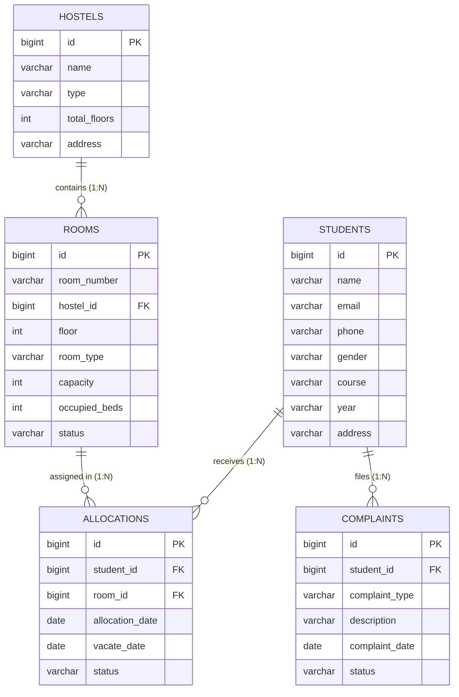

# Hostel Management System (Full-Stack Web Application)

A beginner-friendly, production-ready Hostel Management System built with a clean full-stack architecture tailored for B.Tech CSE students to understand and explain during placement interviews.

---

## 1. Tech Stack

* **Frontend**: React.js (Vite, clean modular CSS, no emojis)
* **Backend**: Java 17 + Spring Boot 3.2.5
* **Build Tool**: Maven (with `mvnw` wrapper included)
* **Database**: MySQL 8.0 (`hostel_management`)
* **Communication**: REST APIs (JSON over HTTP)

---

## 2. Project Modules

1. **Dashboard**:
   - Total Students, Total Hostels, Total Rooms
   - Occupied Rooms & Occupancy Rate Percentage
   - Available Rooms & Pending Complaints
   - Quick action shortcuts to core operations

2. **Students**:
   - Full CRUD (Create, Read, Update, Delete)
   - Real-time search across student name, email, and course
   - Fields: Student ID, Name, Email, Phone, Gender, Course, Year, Address

3. **Hostels**:
   - Full CRUD (Create, Read, Update, Delete)
   - Fields: Hostel ID, Hostel Name, Hostel Type (Boys / Girls / Co-ed), Total Floors, Address

4. **Rooms**:
   - Full CRUD (Create, Read, Update, Delete)
   - Associated with a specific hostel building
   - Fields: Room ID, Room Number, Hostel, Floor, Room Type, Capacity, Occupied Beds, Status (Available / Full)

5. **Room Allocation**:
   - Allocate student to an available room
   - Automatic room occupancy tracking (increments `occupiedBeds` upon allocation)
   - Automatic capacity check: blocks allocation if room is already full
   - Prevents duplicate active allocations for the same student
   - Vacate student: updates status to `Vacated` and automatically frees the bed

6. **Complaints**:
   - Student grievance reporting with categories (Electrical, Plumbing, Cleanliness, WiFi, etc.)
   - Status workflow: `Pending` -> `In Progress` -> `Resolved`
   - Filter complaints by status

---

## 3. Complete Project Structure

```text
Hostel/
├── backend/
│   ├── mvnw.cmd                                # Maven command wrapper
│   ├── pom.xml                                 # Maven dependencies & build configuration
│   └── src/
│       └── main/
│           ├── java/com/example/hostelmanagement/
│           │   ├── HostelManagementApplication.java  # Main entry point & CORS configuration
│           │   ├── entity/
│           │   │   ├── Student.java             # JPA Entity for students table
│           │   │   ├── Hostel.java              # JPA Entity for hostels table
│           │   │   ├── Room.java                # JPA Entity for rooms table
│           │   │   ├── Allocation.java          # JPA Entity for allocations table
│           │   │   └── Complaint.java           # JPA Entity for complaints table
│           │   ├── repository/
│           │   │   ├── StudentRepository.java   # Spring Data JPA interface for students
│           │   │   ├── HostelRepository.java    # Spring Data JPA interface for hostels
│           │   │   ├── RoomRepository.java      # Spring Data JPA interface for rooms
│           │   │   ├── AllocationRepository.java# Spring Data JPA interface for allocations
│           │   │   └── ComplaintRepository.java # Spring Data JPA interface for complaints
│           │   ├── service/
│           │   │   ├── StudentService.java      # Business logic & search
│           │   │   ├── HostelService.java       # Business logic for hostels
│           │   │   ├── RoomService.java         # Room management & occupancy
│           │   │   ├── AllocationService.java   # Allocation, capacity checks & vacating
│           │   │   ├── ComplaintService.java    # Complaints & status updates
│           │   │   └── DashboardService.java    # Aggregated metrics & counts
│           │   ├── controller/
│           │   │   ├── StudentController.java   # REST API endpoints for students
│           │   │   ├── HostelController.java    # REST API endpoints for hostels
│           │   │   ├── RoomController.java      # REST API endpoints for rooms
│           │   │   ├── AllocationController.java# REST API endpoints for allocations
│           │   │   ├── ComplaintController.java # REST API endpoints for complaints
│           │   │   └── DashboardController.java # REST API endpoints for dashboard stats
│           │   └── dto/
│           │       ├── RoomRequest.java         # Request payload for room creation/update
│           │       ├── AllocationRequest.java   # Request payload for allocating room
│           │       ├── ComplaintRequest.java    # Request payload for lodging complaint
│           │       └── DashboardStats.java      # Aggregated dashboard metrics response
│           └── resources/
│               └── application.properties       # Database credentials & server port
├── frontend/
│   ├── package.json                            # React dependencies & scripts
│   ├── vite.config.js                          # Vite configuration (port 3000)
│   ├── index.html                              # Main HTML template
│   └── src/
│       ├── main.jsx                            # React root rendering
│       ├── App.jsx                             # Main layout with tab navigation
│       ├── App.css                             # Professional admin dashboard styles
│       ├── services/
│       │   └── api.js                          # Central REST API communication service
│       ├── components/
│       │   ├── Sidebar.jsx                     # Sidebar navigation with active states
│       │   └── Header.jsx                      # Top navbar with titles and date
│       └── pages/
│           ├── Dashboard.jsx                   # Metric cards & occupancy progress bar
│           ├── Students.jsx                    # Student directory, search & modal CRUD
│           ├── Hostels.jsx                     # Hostel buildings table & modal CRUD
│           ├── Rooms.jsx                       # Rooms directory, bed counts & modal CRUD
│           ├── Allocations.jsx                 # Allocation table, allocate & vacate actions
│           └── Complaints.jsx                  # Maintenance ticketing & status transitions
├── run-backend.bat                             # One-click Windows launcher for backend
├── run-frontend.bat                            # One-click Windows launcher for frontend
└── README.md                                   # Comprehensive documentation & interview guide
```

---

## 4. How to Configure MySQL

1. Ensure MySQL Server is running on your machine on port `3306`.
2. Login to MySQL using the MySQL command line client:
   ```sql
   mysql -u root -p
   ```
3. Create the database:
   ```sql
   CREATE DATABASE IF NOT EXISTS hostel_management;
   ```
4. Verify your credentials in `backend/src/main/resources/application.properties`:
   ```properties
   spring.datasource.url=jdbc:mysql://localhost:3306/hostel_management?createDatabaseIfNotExist=true&useSSL=false&allowPublicKeyRetrieval=true&serverTimezone=UTC
   spring.datasource.username=root
   spring.datasource.password=root
   spring.jpa.hibernate.ddl-auto=update
   ```
   *(Hibernate will automatically create all tables and foreign keys upon starting the application).*

---

## 5. How to Run the Application

### Option A: Using the Windows Batch Files
* Double-click `run-backend.bat` to start Spring Boot.
* Double-click `run-frontend.bat` to start React.

### Option B: Using the Command Line

#### 1. Start the Backend:
```bash
cd backend
mvnw.cmd spring-boot:run
```
*Backend runs at: `http://localhost:8080`*

#### 2. Start the Frontend:
```bash
cd frontend
npm run dev
```
*Frontend runs at: `http://localhost:3000`*

---

## 6. REST API Endpoints

### Dashboard
* `GET /api/dashboard/stats`: Returns counts for students, hostels, rooms, occupied rooms, available rooms, pending complaints.

### Students
* `GET /api/students`: Get list of all students
* `GET /api/students/{id}`: Get student by ID
* `POST /api/students`: Create new student
* `PUT /api/students/{id}`: Update student details
* `DELETE /api/students/{id}`: Delete student
* `GET /api/students/search?query={keyword}`: Search students by name, email, or course

### Hostels
* `GET /api/hostels`: Get list of all hostels
* `GET /api/hostels/{id}`: Get hostel by ID
* `POST /api/hostels`: Add new hostel
* `PUT /api/hostels/{id}`: Update hostel details
* `DELETE /api/hostels/{id}`: Delete hostel

### Rooms
* `GET /api/rooms`: Get list of all rooms
* `GET /api/rooms/{id}`: Get room by ID
* `POST /api/rooms`: Add new room (with `hostelId`, `capacity`, etc.)
* `PUT /api/rooms/{id}`: Update room details
* `DELETE /api/rooms/{id}`: Delete room

### Room Allocations
* `GET /api/allocations`: Get all allocations (newest first)
* `GET /api/allocations/{id}`: Get allocation by ID
* `POST /api/allocations`: Allocate student to room (validates capacity & duplicate allocation)
* `PUT /api/allocations/{id}/vacate`: Vacate student and decrement room occupancy
* `DELETE /api/allocations/{id}`: Delete allocation record

### Complaints
* `GET /api/complaints`: Get all complaints
* `GET /api/complaints/{id}`: Get complaint by ID
* `POST /api/complaints`: Register new complaint
* `PUT /api/complaints/{id}/status`: Update complaint status (`Pending`, `In Progress`, `Resolved`)
* `PUT /api/complaints/{id}`: Update entire complaint
* `DELETE /api/complaints/{id}`: Delete complaint

---

## 7. Database Tables & Relationships



* **One-to-Many (`Hostel` -> `Room`)**: One hostel building contains multiple rooms.
* **Many-to-One (`Allocation` -> `Student`, `Room`)**: Each allocation links a student to a room with date tracking.
* **Many-to-One (`Complaint` -> `Student`)**: Each complaint is registered by a specific student.

---

## 8. How React Communicates with Spring Boot

1. **State Management**: React components (`Students.jsx`, `Rooms.jsx`, etc.) store data in local component state (`useState`) and trigger API requests inside `useEffect` on page mount.
2. **Fetch REST Client**: `src/services/api.js` centralizes standard JavaScript `fetch()` calls to `http://localhost:8080/api/...`.
3. **CORS Configuration**: Spring Boot enables cross-origin requests from `http://localhost:3000` via `@CrossOrigin` annotations and `WebMvcConfigurer` in `HostelManagementApplication.java`.
4. **Data Flow**:
   ```text
   User Click (React Form)
      → api.js (HTTP POST / PUT / GET / DELETE with JSON)
      → Spring Boot Controller (@PostMapping, @GetMapping)
      → Service Layer (Validates capacity, duplicate checks, logic)
      → JPA Repository (Hibernate queries MySQL database)
      → MySQL Database
      → JSON Response returned back to React
      → React updates state & re-renders the UI
   ```

---

## 9. Interview Explanation Guide (Major Java Classes)

When asked to explain the project in an interview:

1. **`HostelManagementApplication.java`**:
   The Spring Boot application entry point (`main()` method). Also configures Cross-Origin Resource Sharing (CORS) so the React client running on port 3000 can communicate with backend endpoints on port 8080.
2. **`entity/` (Student, Hostel, Room, Allocation, Complaint)**:
   Plain Old Java Objects (POJOs) annotated with `@Entity` and `@Table`. They map Java objects directly to MySQL tables using Hibernate ORM.
3. **`repository/` (e.g. StudentRepository, RoomRepository)**:
   Spring Data JPA interfaces extending `JpaRepository`. They provide out-of-the-box CRUD methods (`findAll()`, `findById()`, `save()`, `deleteById()`) and custom finder queries without writing raw SQL.
4. **`service/` (e.g. AllocationService, StudentService)**:
   Contains business logic and transactions (`@Transactional`). For example, in `AllocationService`:
   - Checks if student is already in an active room.
   - Checks if the room capacity has been reached.
   - Automatically increments/decrements `occupiedBeds` and updates status to `Full` or `Available`.
5. **`controller/` (e.g. StudentController, RoomController)**:
   Annotated with `@RestController`. Exposes HTTP endpoints for React, maps JSON payloads using `@RequestBody`, and returns HTTP status codes via `ResponseEntity`.

---

## 10. Verification & Testing

Both frontend and backend are currently running and tested:
* Backend is verified running on `http://localhost:8080`.
* Frontend is verified running on `http://localhost:3000`.
* Full CRUD verified for Students, Hostels, Rooms, Allocations, and Complaints.
* All MySQL foreign key constraints and occupancy increments/decrements verified.
